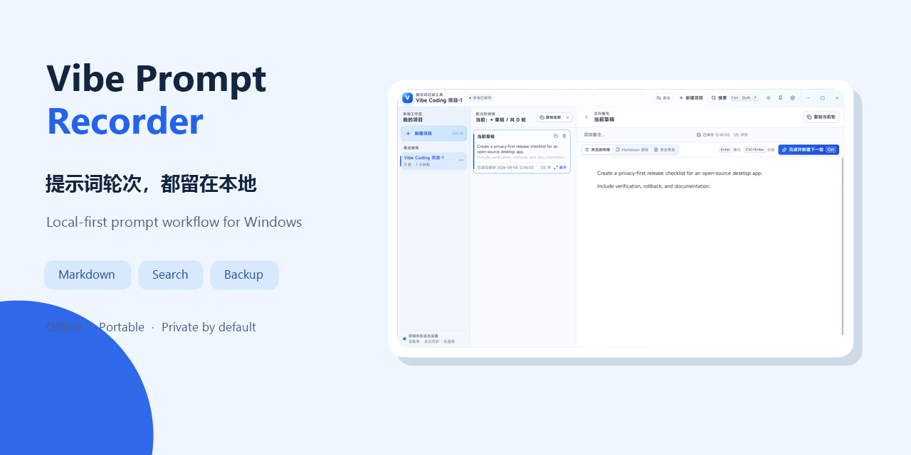
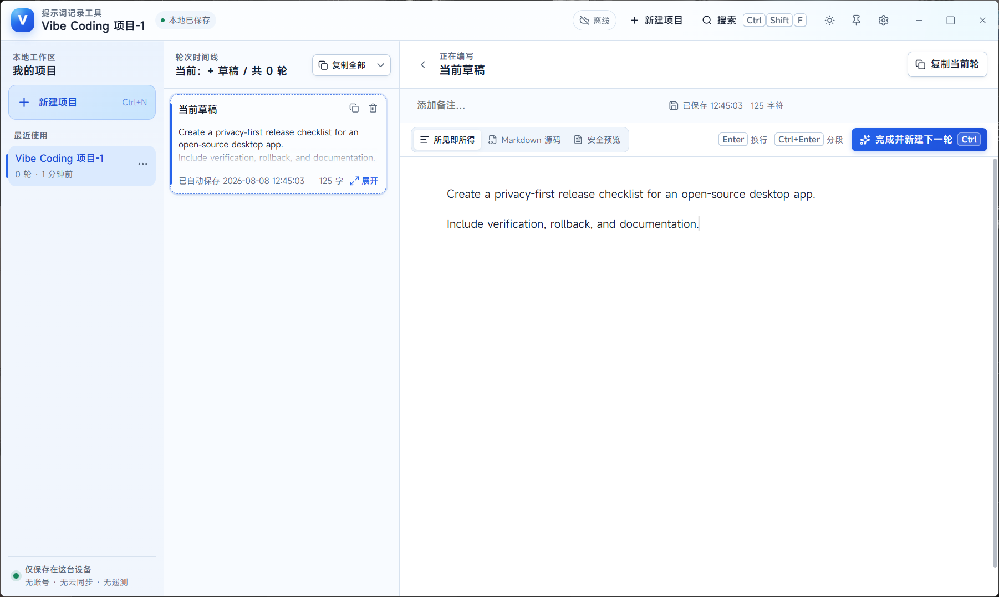

<p align="center">
  
</p>

# Vibe Prompt Recorder · 提示词记录工具

[](https://github.com/ferretgeek/VibePromptRecorder/actions/workflows/ci.yml)
[](./LICENSE)
[](#开发与验证)

> 把每一轮提示词，留在本地时间线。  
> Keep every prompt iteration in a private local timeline.

## 中文

Vibe Prompt Recorder 是一个面向 Windows 10/11 的本地离线提示词工作台。它不调用模型 API、不生成回答、不要求账号，也不会上传项目、提示词或遥测；它只负责把 Vibe Coding 过程中的项目、草稿、轮次和上下文整理清楚。

### 核心能力

- **项目与轮次时间线：** 草稿自动保存，一键完成当前轮并继续下一轮。
- **双编辑体验：** 所见即所得与 Markdown 源码模式，支持代码高亮和安全预览。
- **全局搜索：** 查询项目、备注、草稿、历史轮次与代码内容。
- **本地可靠存储：** SQLite WAL、原子写入、关闭保护、冲突处理与崩溃恢复。
- **可携带数据：** 项目导入导出、完整备份、恢复与数据目录迁移。
- **可定制界面：** 六套主题、独立界面/正文/代码字体、置顶与键盘工作流。

### 真实界面预览

截图来自临时空数据目录，只包含为开源展示编写的合成示例；没有使用或复制真实提示词。

<p align="center">
  
</p>

### 开发与验证

需要 Node.js 22、pnpm 10、Rust 1.89+、Windows WebView2 与 Tauri 2 构建环境。

```powershell
cd 开发文件夹
pnpm install --frozen-lockfile
pnpm verify
```

仅运行 Web 端测试和构建：

```powershell
pnpm lint
pnpm typecheck
pnpm test
pnpm build:web
```

完整使用说明见 [`需求和方案文件夹/README-使用说明.md`](./需求和方案文件夹/README-使用说明.md)，架构、恢复和验收事实见 [`需求和方案文件夹/README.md`](./需求和方案文件夹/README.md)。

### 目录

```text
开发文件夹/              React、TypeScript、Tauri 与 Rust 源码
需求和方案文件夹/        使用说明、架构决策、追踪表与验收报告
docs/images/             脱敏后的真实预览与分享封面
成品文件夹/              本机成品和用户数据；始终被 Git 忽略
```

### 隐私与边界

- 默认离线运行，不接入任何 AI 模型、云同步、账号系统或遥测服务。
- 远程图片只在用户内容明确引用时按安全策略加载；本地 Markdown 预览会执行清洗。
- 活动数据目录不应放在 UNC、映射网络驱动器或实时同步目录中。
- 首次公开版本只发布源码；本机个人便携包、用户数据库和历史备份不会上传。

## English

Vibe Prompt Recorder is an offline, local-first prompt workspace for Windows 10 and 11. It does not call model APIs, generate answers, require an account, upload prompts, or collect telemetry. Its job is to organize projects, drafts, iterations, and context during Vibe Coding.

### Highlights

- **Project timelines:** Autosave drafts, finish the current iteration, and continue with the next one in a single action.
- **Two editing modes:** WYSIWYG and Markdown source editing with syntax highlighting and sanitized previews.
- **Global search:** Search projects, notes, drafts, completed iterations, and code.
- **Reliable local storage:** SQLite WAL, atomic writes, close protection, conflict handling, and recovery.
- **Portable data:** Project import/export, full backups, restore, and data-directory migration.
- **Personal workspace:** Six themes, separate UI/body/code fonts, always-on-top, and keyboard-first controls.

### Development

Install Node.js 22, pnpm 10, Rust 1.89+, Windows WebView2, and the Tauri 2 prerequisites:

```powershell
cd 开发文件夹
pnpm install --frozen-lockfile
pnpm verify
```

The first public version publishes source code only. Personal portable packages, user databases, and historical backups remain excluded. See the Chinese documentation index for the complete release and verification boundary.

## License

Application source code is released under the [MIT License](./LICENSE). Bundled fonts and other third-party assets retain their own licenses under [`开发文件夹/src-tauri/resources/LICENSES`](./开发文件夹/src-tauri/resources/LICENSES/) and are not relicensed under MIT.
